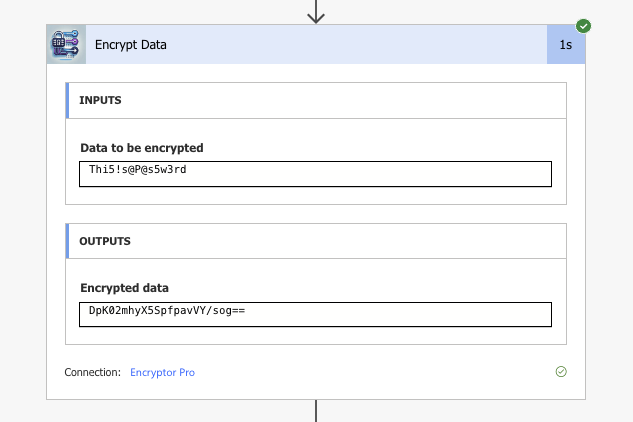
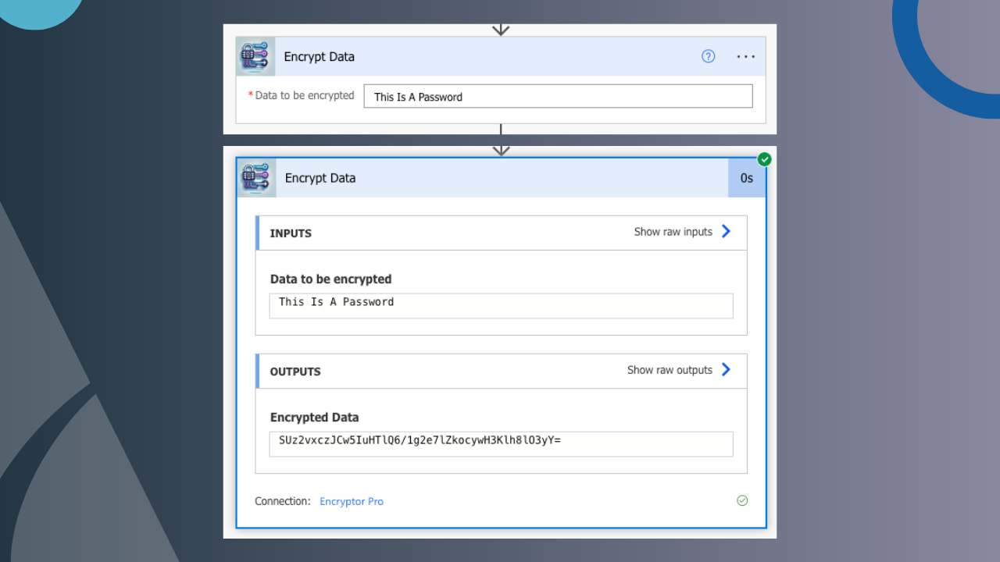
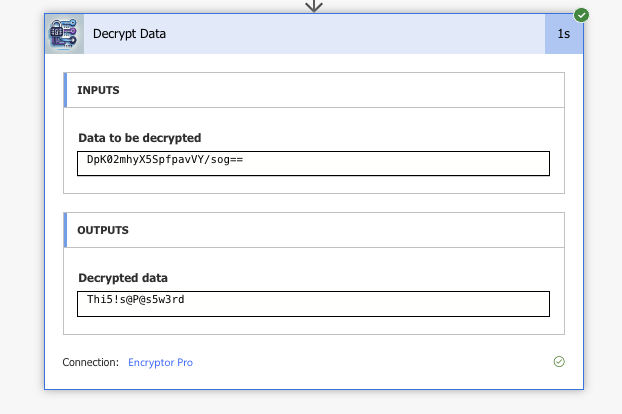
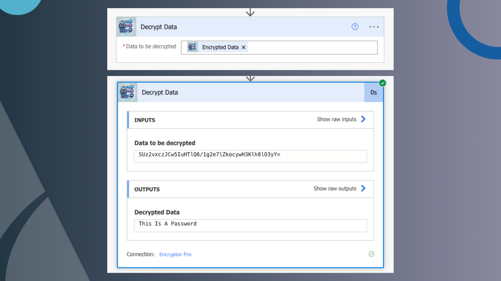
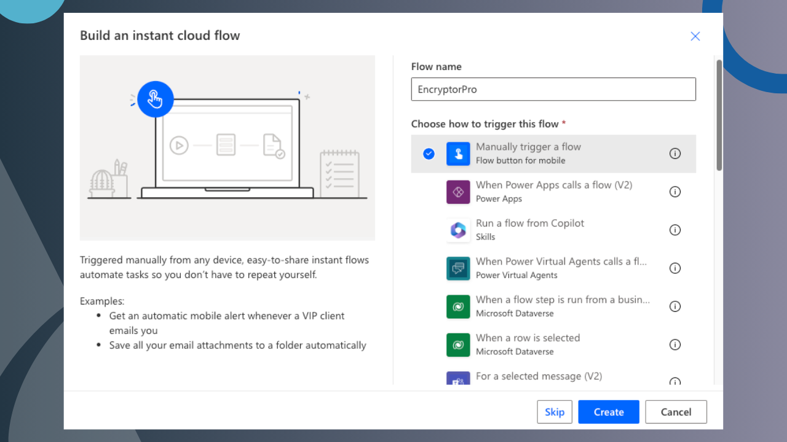
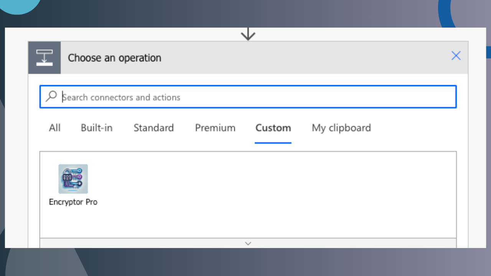
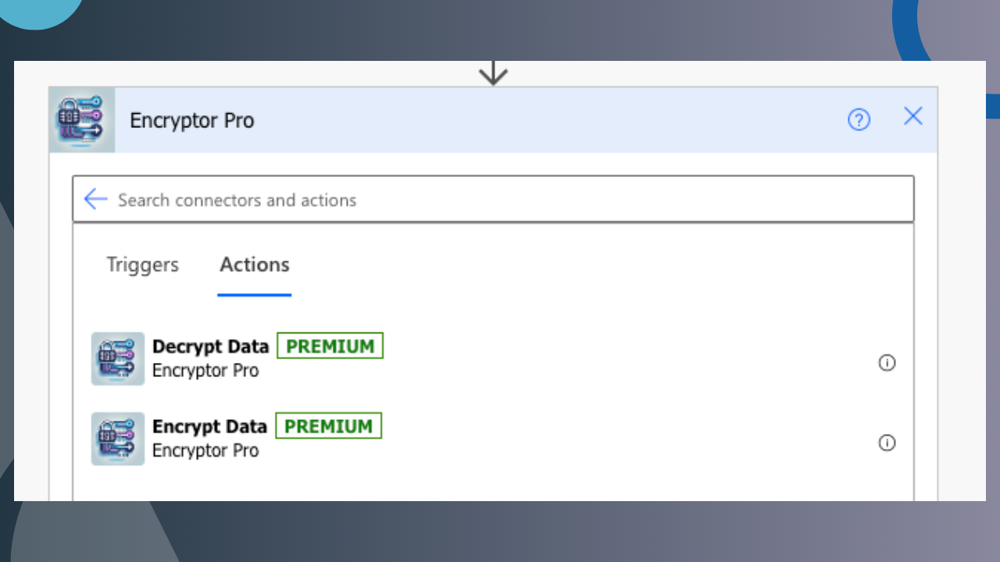

# EncryptorPro

EncryptorPro is a comprehensive solution designed to enhance data security by providing robust encryption capabilities for your cloud-based applications.

## Features

- **Advanced Encryption**: Utilizes state-of-the-art encryption algorithms to protect your data.
- **Seamless Integration**: Easily integrates with various cloud platforms to ensure data security across all your applications.
- **User-Friendly Interface**: Intuitive design allows for easy navigation and configuration.

### **Encrypt Feature**
Encrypt your data seamlessly using the EncryptorPro connector.

*Example Encrypt Response:*

### **Decrypt Feature**
Easily decrypt your previously encrypted data.

*Example Decrypt Response:*

## Getting Started

To get started with EncryptorPro, follow these steps:

### 1. Import the EncryptorPro Solution

1. **Download the Solution**: Obtain the latest version of the EncryptorPro solution package from my [GitHub Repository](Solution).
2. **Access Your Environment**: Log in to your cloud service environment where you intend to deploy EncryptorPro.
3. **Import the Solution**:
   - Navigate to the solutions section of your environment.
   - Select the option to import a new solution.
   - Upload the EncryptorPro solution package you downloaded earlier.
   - Follow the on-screen instructions to complete the import process.

For detailed instructions, refer to the [Import the EncryptorPro Solution guide](https://turtledovecloudsolutions.com/docs/import-the-encryptorpro-solution/).

### 2. Set Up the EncryptorPro Connector

After importing the solution, set up the EncryptorPro connector to enable seamless communication between your applications and the encryption services. Open Power Automate and create a new Instant flow. Give the flow a name and select Manually trigger a flow.

1. **Find the EncryptorPro Custom Connector**:
   - Navigate to the connectors section in your new action.
   - Locate the EncryptorPro connector and select it.

2. **Select an Action**:
   - Choose between Encrypt Data or Decrypt Data actions.
   - No API keys or account IDs are required—simply authorise the connector to start using it.

For a step-by-step walkthrough, consult the [Set Up the EncryptorPro Connector guide](https://turtledovecloudsolutions.com/docs/set-up-the-encryptorpro-connector/).

## License

EncryptorPro is licensed under the [MIT License](LICENSE).
